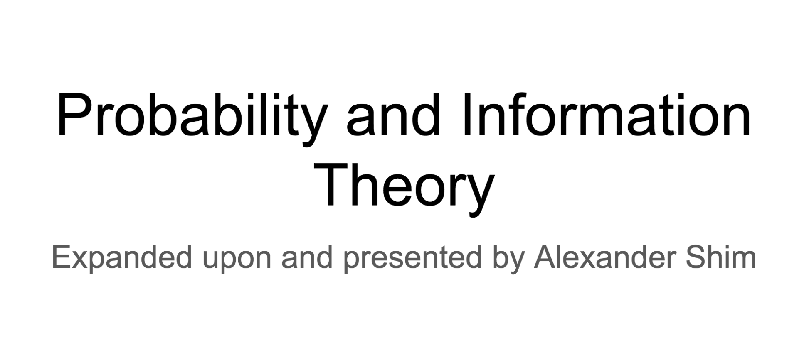

# Deep Learning Book Chapter 3 Probability & Information Theory

## Chapter Link

[Chapter 3 Probability](http://www.deeplearningbook.org/contents/prob.html)

## Presentation Slides

[Probability & Information Theory Presentation by Alex Shim](DLB-Probability_Theory-Shim.pdf) 

## Online Discussion

<VIDEO>https://youtu.be/m-eyp6wq8i8</VIDEO>

## Additional Resources

[Probability cheet sheet](http://www.wzchen.com/probability-cheatsheet/)

[Probability and Computing](http://www.mscs.dal.ca/~janssen/5340/ToRead/mitzenmacher-upfal.pdf)

